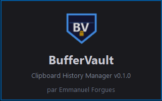
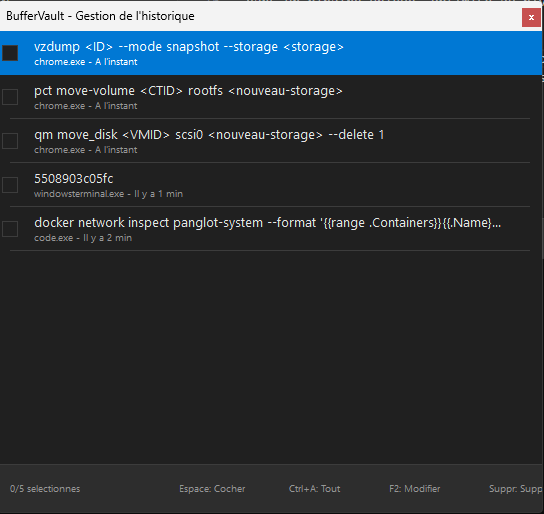

# BufferVault

**Encrypted clipboard history manager for Windows**



---

## Overview

BufferVault is a lightweight and secure system tool for Windows 10/11 that automatically captures every copy operation and stores an encrypted history of all clipboard entries. At any time you can recall the history, browse through past entries and select the one you need -- it goes straight to your clipboard, ready to paste wherever you want.

### Key highlights

- **Pure Rust** -- zero external dependencies, only Win32 APIs
- **AES-256-GCM encryption** -- the entire history is encrypted at rest
- **DPAPI-protected master key** -- secured by the Windows credential store
- **Lightweight** -- ~134 KB binary (UPX-compressed), < 15 MB memory footprint

---

## Features

| Feature | Description |
|---------|-------------|
| Automatic capture | Intercepts every copy (text, files) via `AddClipboardFormatListener` |
| Encrypted history | Up to 500 entries (configurable) stored with AES-256-GCM |
| Instant search | Incremental search from the popup window |
| Pinning | Protect entries from automatic rotation |
| Deduplication | Consecutive identical copies are not duplicated |
| Multiple display modes | Popup, sidebar, permanent window or minimal |
| Dark / Light theme | Choose your preferred UI theme |
| DPI-aware | High-resolution display support (100% to 200%) |
| Splash screen | Startup animation with fade-out |
| History manager | Dedicated window to view, edit and batch-delete entries |
| Launch at startup | Optional auto-start with Windows via registry (toggle from tray menu) |

---

## Installation

1. Download `buffervault.exe` from the [Releases](https://github.com/odaiko42/bufferVault/releases) page
2. Place the executable in any folder of your choice
3. Run `buffervault.exe`

BufferVault installs itself in the notification area (system tray) and runs in the background.

Data is stored in `%APPDATA%\BufferVault\`:
- `vault.dat` -- encrypted history
- `config.txt` -- user configuration
- `keystore.bin` -- master key protected by DPAPI

---

## Usage

### Main keyboard shortcut

| Shortcut | Action |
|----------|--------|
| **Ctrl+Alt+V** | Open / close the clipboard history popup |

### Popup navigation

| Key | Action |
|-----|--------|
| Up / Down arrow | Navigate through the list |
| Enter | Copy the selected entry to the clipboard |
| Escape | Close the popup without changes |
| Delete | Remove the selected entry |
| Double-click | Pin / unpin an entry |
| Mouse wheel | Scroll through the list |
| Type any character | Incremental search |

> After selecting an entry, the text is placed in the clipboard.
> Paste it wherever you want with **Ctrl+V** or **Right-click > Paste**.

### Tray menu (right-click on the icon)

| Option | Description |
|--------|-------------|
| Show/Hide | Open or close the popup |
| Manage history... | Open the full history manager |
| Clear history | Delete all non-pinned entries |
| Launch at startup | Toggle auto-start with Windows (checkmark when enabled) |
| About... | Application information |
| Quit | Save and close BufferVault |

### History manager

Accessible from the tray menu, the history manager lets you view, edit and batch-delete entries.



| Key | Action |
|-----|--------|
| Up / Down arrow | Navigate through the list |
| Space | Check / uncheck the item under the cursor |
| Ctrl+A | Select all / deselect all |
| F2 | Edit the content of the selected entry |
| Delete | Remove checked entries (or the current entry) |
| Enter | Copy to clipboard and close |
| Escape | Close the manager |

---

## Configuration

The configuration file is located at `%APPDATA%\BufferVault\config.txt`.
It is created automatically on first launch with default values.

```ini
# Keyboard shortcut (modifiers: ctrl, alt, shift, win)
hotkey_modifiers = ctrl+alt
hotkey_key = V

# Display mode: popup, sidebar, permanent, minimal
display_mode = popup

# Theme: dark, light
theme = dark

# Maximum number of history entries
max_history = 500

# Maximum size per entry (bytes)
max_entry_size = 1048576

# Maximum retention (days)
retention_days = 30

# Number of visible items in the popup
visible_items = 8

# Close popup after selection
close_after_select = true

# Excluded applications (comma-separated)
excluded_apps = 
```

---

## Security

| Component | Implementation |
|-----------|----------------|
| Encryption | AES-256-GCM (pure Rust implementation) |
| Key derivation | PBKDF2-HMAC-SHA256, 100,000 iterations |
| Random generator | `BCryptGenRandom` (Windows CSPRNG) |
| Key protection | Windows DPAPI (`CryptProtectData`) |
| Integrity | HMAC-SHA256 on every entry |
| Memory | Sensitive buffers are zeroed before deallocation |

---

## Author

**Emmanuel Forgues**

---

## License

This project is distributed under the MIT License.
